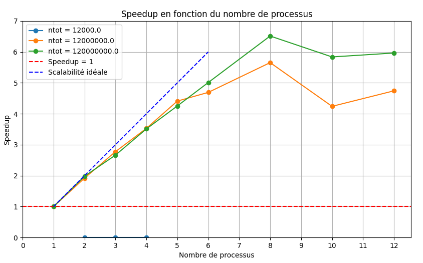

#### Lemouton Alexis INF3FA

# Rapport : Programmation Avancée Séance + TP 4 + notes

### Séance 13 décembre

###### Futur : quand une tâche asynchrone est terminée et qu'elle sert dans la suite du code, elle doit être mise à jour avant de continuer dans le code.
Manière d'expliquer les dépendances entre les tâches

###### Opération atomique : type d’opération qui s’exécute sans interruption, garantissant qu’elle est réalisée en une seule unité indivisible

###### Weak scaling : is defined as how the solution time varies with the number of processors for a fixed problem size per processor. Sp ~= 1

### TP4
> #### Assignment102 + Pi :
>
> _Assignement 102 :_ paramètres ntot et nb processor
> _pi :_ calculer ntot/p avec p = nbworker
>
> ##### Comparaison des résultats :
>
> **Vérification** que les sorties de Assignment102 et de Pi sont identiques
> **Sauvegarde** des sorties dans des fichiers textes : out_ass102_salle4c.txt pour assignement_102 et out_pi_salle_4c.txt pour pi
> avec les valeurs : 
> - Approximatisation de la valeur de pi
> - L'erreur relative
> - Le nombre de workers
> - Le nombre de processeur disponible
> - Le temps d'exécution

### Séance 17 janvier
**Scalabilité forte :** Effectuer plus rapidement les mêmes simulations
**Scalabilité faible :** Simuler des modèles plus grands ou plus détaillés sans augmenter la durée d'exécution

### TP4 (suite)

WorkerSocket --> 2 attributs : port et isRunning
Une méthode : Main

**
> Création de 2 workers sur 2 ports différents : 25545 et 25546
> 
> SOCKET = Socket[addr=/127.0.0.1,port=25545,localport=52258]
> SOCKET = Socket[addr=/127.0.0.1,port=25546,localport=52259]
> Client sent: 12565291
> Client sent: 12565594
> 
> Pi : 3.141360625
> Error: 7.385699400846197E-5
> 
> Ntot: 32000000
> Available processors: 2
> Time Duration (ms): 565
> 
> 7.385699400846197E-5 32000000 2 565
**
 

Cette image illustre un diagramme de scalabilité. 

1. **Forte scalabilité** :
   - **Définition** : La forte scalabilité mesure la façon dont le temps de résolution varie en fonction du nombre de processeurs pour une taille totale de flèches dans cet exemple.
   - **Scénario idéal** : Dans un scénario idéal, doubler le nombre de processeurs réduit de moitié le temps de résolution.
   - **Représentation graphique** : Le graphique montre une courbe où le temps de résolution diminue au fur et à mesure que le nombre de processeurs augmente, en suivant idéalement une relation 1/x.

2. **Faible scalabilité** :
   - **Définition** : La scalabilité faible (ou faible mise à l'échelle) mesure la manière dont le temps de résolution varie en fonction du nombre de processeurs pour une taille de problème fixe par processeur.
   - **Scénario idéal** : Dans un scénario idéal, le temps de résolution reste constant lorsque le nombre de processeurs augmente.
   - **Représentation graphique** : Le graphique montre une ligne horizontale indiquant que le temps de résolution reste constant lorsque le nombre de processeurs augmente.

#### Éléments du diagramme :

- **Axe X** : nombre de processeurs.
- **Axe Y** : temps d'exécution.
- **Courbe de forte évolutivité** : Courbe de forte extensibilité** : courbe à pente descendante indiquant la diminution du temps d'exécution avec l'augmentation du nombre de processeurs.
- **Ligne d'extensibilité faible** : Ligne horizontale indiquant un temps d'exécution constant avec un nombre croissant de processeurs.
