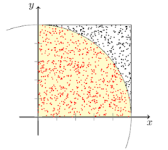
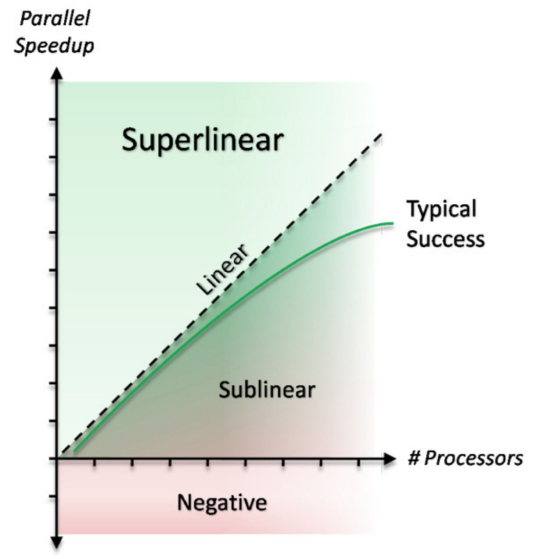
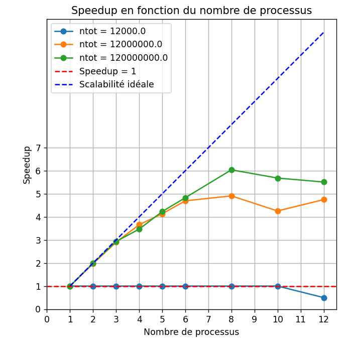
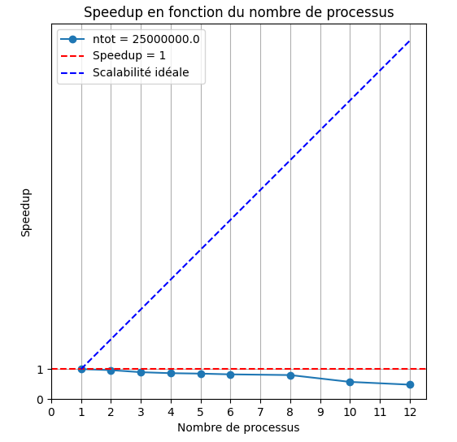
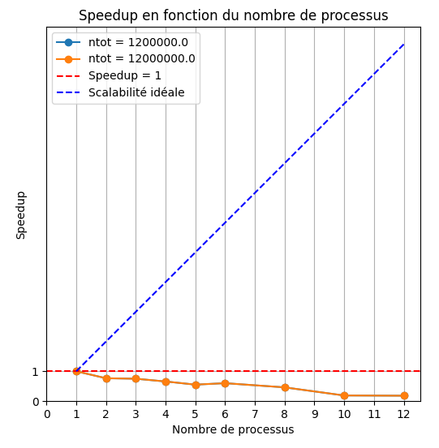
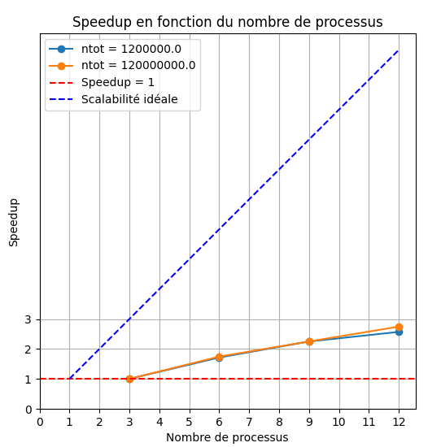

#### Lemouton Alexis INF3FA

# Rapport : Programmation Avancée Séance + TP 4 + Notes

## Séance 13 décembre

### Futur

Quand une tâche asynchrone est terminée et qu'elle sert dans la suite du code, elle doit être mise à jour avant de continuer dans le code.  
**Manière d'expliquer les dépendances entre les tâches**

### Opération atomique

Type d’opération qui s’exécute sans interruption, garantissant qu’elle est réalisée en une seule unité indivisible.

### Weak scaling

Défini comme la variation du temps de solution en fonction du nombre de processeurs pour une taille de problème fixe par processeur. Sp ~= 1

# TP4

Dans ce TP, on s'intéresse à calculer et estimer la probabilité de trouver $\pi$. Pour trouver une valeur proche de ce nombre infini,
on utilisera la méthode de Monte Carlo en exploitant le parallélisme sur des architectures à mémoire partagée et distribuée.

La méthode de Monte Carlo s'appuie sur une estimation probabiliste pour s'approcher de la valeur de $\pi$ à partir de tirages aléatoires.

Soit $A_{\text{quartD}}$ l'aire d'un quart de disque de rayon $r = 1$ :

Le quart de disque est contenu dans un carré de côté $r = 1$, dont l'aire vaut :
$$A_c = r^2 = 1$$
On suppose qu'un point $X_p(x_p, y_p)$ est généré aléatoirement dans ce carré, où $x_p$ et $y_p$ suivent la loi uniforme $U(]0,1[)$.
La probabilité que $X_p$ se situe dans le quart de disque est déterminée par :
$$P = \frac{A_{\text{quartD}}}{A_c} = \frac{\pi}{4}$$

Pour évaluer cette probabilité, on réalise $n_{\text{tot}}$ tirages aléatoires. Soit $n_{\text{cible}}$ le nombre de points qui vérifient la condition 
$x_p^2 + y_p^2 \leq 1$, c’est-à-dire les points situés dans la zone du quart de disque.

  
Si $n_{\text{tot}}$ est suffisamment grand, par la loi des grands nombres, la fréquence observée $n_{\text{cible}} / n_{\text{tot}}$ converge vers la probabilité $P$, soit :  
$$P = \frac{n_{\text{cible}}}{n_{\text{tot}}} \approx \frac{\pi}{4}$$

On peut ainsi en déduire une approximation de π :  
$$\pi \approx 4 \cdot \frac{n_{\text{cible}}}{n_{\text{tot}}}$$

Ainsi, plus $n_{\text{tot}}$ augmente, plus l'estimation de π se précise.

### Assignment102 + Pi

**Assignement 102 :** paramètres `ntot` et `nb processor`  
**Pi :** calculer `ntot/p` avec `p = nbworker`

#### Comparaison des résultats

- **Vérification** que les sorties de `Assignment102` et de `Pi` sont identiques
- **Sauvegarde** des sorties dans des fichiers textes : `out_ass102_salle4c.txt` pour `assignement_102` et `out_pi_salle_4c.txt` pour `pi`

Avec les valeurs :
- Approximatisation de la valeur de pi
- L'erreur relative
- Le nombre de workers
- Le nombre de processeurs disponibles
- Le temps d'exécution

## Séance 17 janvier

### Scalabilité forte

Effectuer plus rapidement les mêmes simulations.

### Scalabilité faible

Simuler des modèles plus grands ou plus détaillés sans augmenter la durée d'exécution.

## TP4 (suite)

### WorkerSocket

- **Attributs :** `port` et `isRunning`
- **Méthode :** `Main`

**Exemple de création de 2 workers sur 2 ports différents : 25545 et 25546**

> Création de 2 workers sur 2 ports différents : 25545 et 25546
>
> SOCKET = Socket[addr=/127.0.0.1,port=25545,localport=52258]
> SOCKET = Socket[addr=/127.0.0.1,port=25546,localport=52259]
> Client sent: 12565291
> Client sent: 12565594
>
> Pi : 3.141360625
> Error: 7.385699400846197E-5
>
> Ntot: 32000000
> Available processors: 2
> Time Duration (ms): 565
>
> 7.385699400846197E-5 32000000 2 565

---

Cette image illustre un diagramme de scalabilité forte effectuée avec le programme Pi et Assigment102.
En bleu pointillé : la scalabilité idéale.

En bleu, la scalabilité forte est exécuté trop rapidement, et ne permet pas donc de bien mesurer avec précision. 
En effet, le speedup est proche de 1ms pour chaque processeur et ainsi ne permet pas une lecture précise.

En orange et vert, la scalabilité forte, où le nombre de processeurs augmente en fonction du temps de résolution.
Tout dépend de la taille de flèches lancées.

> #### **Forte scalabilité** :
> **Scénario idéal** : Dans un scénario idéal, doubler le nombre de processeurs réduit de moitié le temps de résolution.  
> **Représentation graphique** : Le graphique montre une courbe où le temps de résolution diminue au fur et à mesure
> que le nombre de processeurs augmente, en suivant idéalement une relation f(x) = x.

  

Ces images illustrent un diagramme de scalabilité faible (à gauche le programme pi, à droite assigment102).  
En bleu la scalabilité faible : où la taille du problème par processeur est fixe et le nombre de processeurs augmente. 
Arrivé à un certain nombre de processeurs, elle s'effondre.

> #### **Faible scalabilité** :
> **Scénario idéal** : Dans un scénario idéal, on fixe la taille du problème par processus et on augmente le nombre de processus.
> C'est-à-dire, la taille du problème augmente avec le nombre de processus.  
> **Représentation graphique** : Lorsque les ressources augmentent, les performances s'améliorent très faiblement puis
> elles atteignent un seuil. Une fois le seuil atteint, le système sature et les performances s’effondrent.

> Exemple de scalabilité :
> forte = 12000000 * 1 processeur ; 6000000 * 2 proc
> faible = 12000000 * 1 processeur ; 24000000 * 2 proc
>
> - faible 12000000 par proc
> - forte 12000000 divisé par le nombre de proc

### Master Worker

Ce graphique illustre le temps de résolution en fonction du nombre de workers et de processeurs.

Sur l'axe vertical, on retrouve le speedUp. Ce speedUp consiste à comparer le temps d'exécution d'une tâche (T(1) séquentielle à celui obtenu en mode parallèle (T(n) avec n unités de traitement.
Le SpeedUp est défini par la formule suivante : 
SpeedUp = T1 / Tn

Par exemple, un speedUp de 3 signifie que la version parallèle est 3 fois plus rapide que la version séquentielle.

Dans une architecture Master Worker, le système se décompose en un Master qui orchestre la répartition des tâches et plusieurs Workers qui exécutent les calculs.

Le rôle du Master est de répartir les tâches entre les Workers, de collecter les résultats et de les agréger pour obtenir le résultat final.
Le rôle des Workers est d'exécuter les tâches qui leur sont attribuées par le Master.

Sur le graphique, on peut observer que lorsqu'on utilise 3 workers et 12 processeurs, on se rapproche d'une exécution 3 fois plus rapide qu'une exécution séquentielle, le temps de résolution est plus rapide. 
